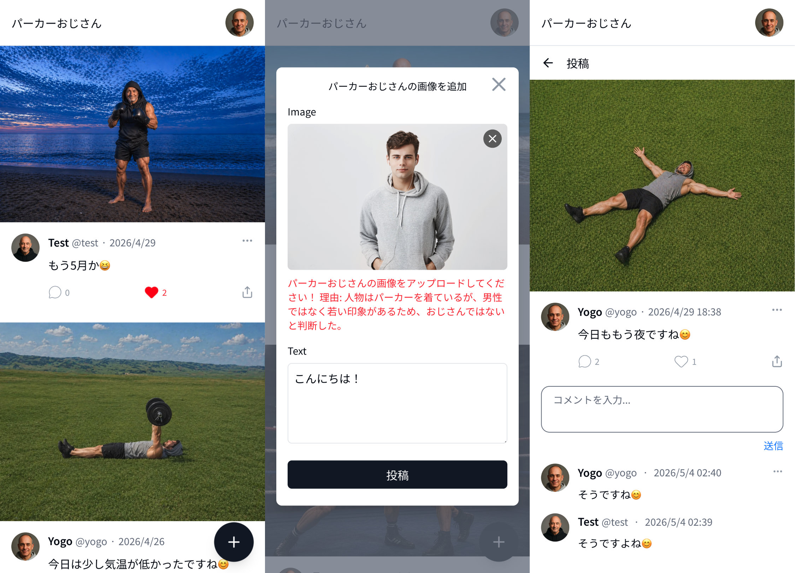

# パーカーおじさん
パーカーを着たおじさんの画像を投稿するサイトです。<br>
投稿時にAIが画像を判定し、パーカーおじさん以外の画像は投稿できません。<br>
レスポンシブ対応しているのでスマホからもご確認いただけます。



## URL
https://parka-ojisan.yogo.dev

## 使用技術
- PHP 8.4
- Laravel 12 / Laravel Breeze
- MySQL 8.0
- React 19 / TypeScript
- Inertia.js v3
- TanStack Query v5
- Tailwind CSS 4
- Vite 7
- Laravel Sanctum（API認証）
- OpenAI API（GPT-4o-mini）
- Intervention Image（画像処理）
- Lucide React（アイコン）

## 開発環境
- Docker / Docker Compose
- Laravel Sail

## 本番環境
- スターレンタルサーバー
- GitHub Actions（mainブランチへのpushで自動デプロイ）

## 機能一覧
- 画像投稿機能
  - ドラッグ&ドロップ対応
  - 画像プレビュー表示
  - 自動リサイズ・WebP変換（Intervention Image）
  - 画像サイズ制限（最小400x400px・最大5MB・最大幅1500pxにリサイズ）
  - アスペクト比制限（1:4 〜 4:1）
  - ファイル形式制限（PNG, JPG, GIF, WebP）
- AI画像判定機能
  - OpenAI GPT-4o-mini による画像分析
  - パーカーおじさん以外は投稿拒否
- いいね機能
  - 楽観的更新
- コメント機能
  - 楽観的更新
  - 「もっと読み込む」による追加取得
- ユーザーページ（`/{username}`）
- 個別投稿ページ（`/{username}/status/{id}`）
- プロフィール編集（アイコン画像・ユーザーID変更対応）
- 画像モーダル（PCのみ）
- 未ログイン制限（投稿・いいね・コメント）
- OGP / メタタグの動的設定
  - 個別投稿ページ：投稿者名をタイトルに・投稿画像をOGP画像に・投稿テキストをdescriptionに
  - ユーザーページ：ユーザー名をタイトルに・プロフィール画像をOGP画像に
  - その他のページ：サイト名をタイトルに・共通OGP画像を使用
- 無限スクロール（TanStack Query）
- レスポンシブデザイン（Tailwind CSS）

## ローカル環境構築

### 必要なもの
- Docker Desktop
- OpenAI API Key

### セットアップ手順

```bash
# リポジトリをクローン
git clone https://github.com/k-yogo/parka-ojisan.git
cd parka-ojisan

# .envファイルを作成
cp .env.example .env

# OpenAI APIキーを設定
# .env ファイルに以下を追加
# OPENAI_API_KEY=sk-proj-xxxxxxxxxxxxx

# Sailを起動
./vendor/bin/sail up -d

# 依存関係をインストール
./vendor/bin/sail composer install
./vendor/bin/sail npm install

# アプリケーションキーを生成
./vendor/bin/sail artisan key:generate

# マイグレーション実行
./vendor/bin/sail artisan migrate

# アセットをビルド
./vendor/bin/sail npm run build

# ストレージリンクを作成
./vendor/bin/sail artisan storage:link
```

### 開発サーバー起動

```bash
./vendor/bin/sail up -d
./vendor/bin/sail npm run dev
```
